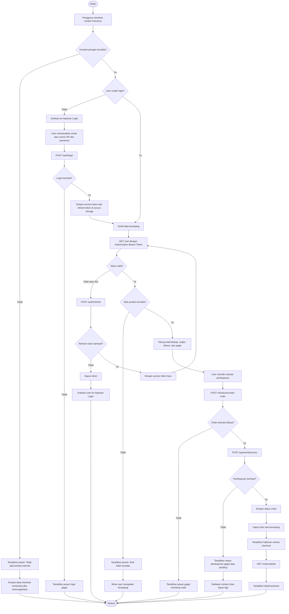

# Algoritma_P11_23343082_RendiAigoBrandon

## Identitas

**Nama:** Rendi Aigo Brandon
**NIM:** 23343082
**Mata Kuliah:** Mobile Programming Lanjutan
**Pertemuan:** 11
**Topik:** Aktivitas Algoritma - Flowchart Checkout, Error Handling, dan Repository Pattern

---

# 1. Flowchart Checkout di Aplikasi E-Commerce

Flowchart berikut menjelaskan alur checkout pada aplikasi e-commerce. Alur ini mencakup pengecekan koneksi jaringan, autentikasi pengguna, refresh token, ketersediaan stok, proses pembayaran, dan hasil akhir transaksi.



## Penjelasan Flowchart

Alur dimulai ketika pengguna menekan tombol checkout. Aplikasi lebih dulu mengecek koneksi jaringan karena checkout membutuhkan komunikasi langsung dengan server. Jika jaringan tidak tersedia, aplikasi menampilkan pesan error dan menghentikan proses.

Jika jaringan tersedia, aplikasi memeriksa status login. Jika pengguna belum login, aplikasi mengarahkan pengguna ke halaman login. Setelah login berhasil, token disimpan di secure storage. Token ini dipakai untuk request checkout berikutnya.

Saat aplikasi mengambil data keranjang, server bisa mengembalikan error 401 jika access token sudah kedaluwarsa. Jika itu terjadi, aplikasi menjalankan refresh token. Jika refresh token berhasil, request asli diulang. Jika gagal, token dihapus dan pengguna diarahkan ke halaman login.

Setelah autentikasi valid, aplikasi mengecek stok produk. Jika stok tidak tersedia, pengguna diminta mengubah keranjang. Jika stok tersedia, aplikasi membuat order, memproses pembayaran, menghapus item dari keranjang, lalu menampilkan halaman sukses checkout.

---

# 2. Algoritma Penanganan Error

Penanganan error harus dibuat jelas agar aplikasi tidak crash, tidak stuck di loading screen, dan tetap memberi feedback yang mudah dipahami pengguna.

| No | Skenario Error | Kondisi | Tindakan Aplikasi | Tampilan UI |
|---|---|---|---|---|
| 1 | Tidak ada koneksi internet | Aplikasi tidak dapat terhubung ke jaringan. Biasanya terjadi karena WiFi atau data seluler mati. | Cek koneksi memakai `connectivity_plus`. Jangan kirim request ke server. Jika ada cache, tampilkan data dari cache. | Banner atau dialog: "Tidak ada koneksi internet. Periksa jaringan Anda." |
| 2 | Server error HTTP 500 | Server gagal memproses request karena gangguan internal. | Jalankan retry maksimal 3 kali dengan exponential backoff. Jika tetap gagal, hentikan request dan catat error ke logging. | Pesan: "Server sedang bermasalah. Coba lagi beberapa saat." Tombol: "Coba Lagi." |
| 3 | Request timeout | Request terlalu lama dan melewati batas waktu, misalnya lebih dari 30 detik. | Batalkan request. Tampilkan pesan koneksi lambat. Sediakan tombol retry. Jangan biarkan loading berjalan terus. | Pesan: "Koneksi terlalu lambat. Silakan coba lagi." |
| 4 | Token kadaluarsa HTTP 401 | Access token sudah expired atau tidak valid. | Interceptor menangkap 401. Kirim request refresh token. Jika berhasil, simpan token baru dan ulangi request asli. Jika gagal, logout user. | Jika refresh berhasil, UI tidak berubah. Jika gagal, tampilkan: "Sesi Anda berakhir. Silakan login kembali." |
| 5 | Format data tidak sesuai | Response API tidak sesuai model yang diharapkan. Contohnya field hilang atau tipe data berbeda. | Tangani parsing dengan try-catch. Log raw response untuk debugging. Tampilkan pesan umum ke pengguna. | Pesan: "Data tidak dapat dimuat saat ini." Tombol: "Muat Ulang." |

## Algoritma Detail

### A. Tidak Ada Koneksi Internet

1. User melakukan aksi yang membutuhkan API.
2. Aplikasi mengecek koneksi dengan `connectivity_plus`.
3. Jika tidak ada koneksi, aplikasi tidak mengirim request.
4. Aplikasi mengecek apakah data cache tersedia.
5. Jika cache tersedia, tampilkan data cache.
6. Jika cache tidak tersedia, tampilkan pesan offline.
7. User diberi tombol untuk mencoba ulang.

### B. Server Error HTTP 500

1. Aplikasi mengirim request ke server.
2. Server mengembalikan status code 500.
3. Aplikasi mengecek apakah error layak di-retry.
4. Aplikasi menunggu 1 detik, lalu mencoba ulang.
5. Jika gagal lagi, aplikasi menunggu 2 detik.
6. Jika gagal lagi, aplikasi menunggu 4 detik.
7. Jika tetap gagal setelah 3 percobaan, aplikasi menghentikan retry.
8. Aplikasi menampilkan pesan server bermasalah.
9. Error dicatat untuk debugging.

### C. Request Timeout

1. Aplikasi mengirim request ke API.
2. Request melewati batas timeout.
3. Dio mengembalikan timeout exception.
4. Aplikasi membatalkan loading.
5. Aplikasi menampilkan pesan koneksi lambat.
6. User diberi tombol retry.
7. Jika user menekan retry, request dikirim ulang.

### D. Token Kadaluarsa HTTP 401

1. Aplikasi mengirim request dengan access token.
2. Server mengembalikan status 401.
3. Dio interceptor menangkap error 401.
4. Aplikasi mengirim `POST /auth/refresh` memakai refresh token.
5. Jika refresh berhasil, access token baru disimpan.
6. Request awal diulang dengan token baru.
7. Jika refresh gagal, semua token dihapus.
8. User diarahkan ke halaman login.
9. Aplikasi menampilkan pesan sesi berakhir.

### E. Format Data Tidak Sesuai

1. Aplikasi menerima response dari API.
2. Data JSON dikonversi ke model Dart.
3. Jika field tidak sesuai, parsing akan gagal.
4. Aplikasi menangkap error dengan try-catch.
5. Aplikasi mencatat raw response ke log.
6. Aplikasi menampilkan pesan umum.
7. Aplikasi tidak menampilkan error teknis kepada user.

---

# 3. Urutan Implementasi Repository Pattern dari Nol

Repository Pattern digunakan untuk memisahkan UI dari sumber data. Dengan pola ini, UI tidak perlu tahu apakah data berasal dari API, cache lokal, atau database lokal. Repository menjadi penghubung utama antara data source dan layer aplikasi.

## 3.1 Struktur Folder yang Disarankan

```text
lib/
├── core/
│   ├── network/
│   │   └── dio_service.dart
│   ├── storage/
│   │   └── token_storage.dart
│   └── error/
│       └── failure.dart
│
├── features/
│   └── product/
│       ├── data/
│       │   ├── datasources/
│       │   │   ├── product_remote_data_source.dart
│       │   │   └── product_local_data_source.dart
│       │   ├── models/
│       │   │   └── product_model.dart
│       │   └── repositories/
│       │       └── product_repository_impl.dart
│       │
│       ├── domain/
│       │   ├── entities/
│       │   │   └── product.dart
│       │   └── repositories/
│       │       └── product_repository.dart
│       │
│       └── presentation/
│           ├── pages/
│           │   └── product_page.dart
│           └── providers/
│               └── product_provider.dart
│
└── injection.dart
```

## 3.2 Langkah 1 - Membuat Abstract Class Repository

Abstract class berfungsi sebagai kontrak. UI dan state management cukup bergantung pada kontrak ini, bukan langsung ke API.

```dart
abstract class ProductRepository {
  Future<List<Product>> getProducts();
  Future<Product> getProductById(String id);
}
```

## 3.3 Langkah 2 - Membuat Model atau Entity

Model digunakan untuk mengubah JSON response menjadi object Dart.

```dart
class Product {
  final String id;
  final String name;
  final int price;

  Product({
    required this.id,
    required this.name,
    required this.price,
  });

  factory Product.fromJson(Map<String, dynamic> json) {
    return Product(
      id: json['id'],
      name: json['name'],
      price: json['price'],
    );
  }

  Map<String, dynamic> toJson() {
    return {
      'id': id,
      'name': name,
      'price': price,
    };
  }
}
```

## 3.4 Langkah 3 - Membuat Remote Data Source

Remote data source bertugas mengambil data dari REST API.

```dart
class ProductRemoteDataSource {
  final Dio dio;

  ProductRemoteDataSource(this.dio);

  Future<List<Product>> fetchProducts() async {
    final response = await dio.get('/products');

    final List data = response.data['data'];

    return data.map((json) => Product.fromJson(json)).toList();
  }

  Future<Product> fetchProductById(String id) async {
    final response = await dio.get('/products/$id');

    return Product.fromJson(response.data['data']);
  }
}
```

## 3.5 Langkah 4 - Membuat Local Data Source

Local data source bertugas menyimpan dan membaca data dari cache lokal.

```dart
class ProductLocalDataSource {
  final Box box;

  ProductLocalDataSource(this.box);

  Future<void> cacheProducts(List<Product> products) async {
    final data = products.map((product) => product.toJson()).toList();

    await box.put('products', data);
    await box.put('cached_at', DateTime.now().toIso8601String());
  }

  Future<List<Product>?> getCachedProducts() async {
    final cachedData = box.get('products');

    if (cachedData == null) {
      return null;
    }

    final List data = cachedData;

    return data.map((json) => Product.fromJson(Map<String, dynamic>.from(json))).toList();
  }
}
```

## 3.6 Langkah 5 - Membuat Repository Implementation

Repository implementation mengatur keputusan apakah aplikasi mengambil data dari API atau cache.

```dart
class ProductRepositoryImpl implements ProductRepository {
  final ProductRemoteDataSource remoteDataSource;
  final ProductLocalDataSource localDataSource;

  ProductRepositoryImpl({
    required this.remoteDataSource,
    required this.localDataSource,
  });

  @override
  Future<List<Product>> getProducts() async {
    try {
      final products = await remoteDataSource.fetchProducts();

      await localDataSource.cacheProducts(products);

      return products;
    } catch (e) {
      final cachedProducts = await localDataSource.getCachedProducts();

      if (cachedProducts != null) {
        return cachedProducts;
      }

      rethrow;
    }
  }

  @override
  Future<Product> getProductById(String id) async {
    return await remoteDataSource.fetchProductById(id);
  }
}
```

## 3.7 Langkah 6 - Membuat Dio Service

Dio service digunakan untuk konfigurasi HTTP client secara terpusat.

```dart
class DioService {
  static Dio createDio() {
    final dio = Dio(
      BaseOptions(
        baseUrl: 'https://api.example.com',
        connectTimeout: const Duration(seconds: 10),
        receiveTimeout: const Duration(seconds: 30),
        headers: {
          'Content-Type': 'application/json',
          'Accept': 'application/json',
        },
      ),
    );

    dio.interceptors.add(
      InterceptorsWrapper(
        onRequest: (options, handler) {
          return handler.next(options);
        },
        onError: (error, handler) {
          return handler.next(error);
        },
      ),
    );

    return dio;
  }
}
```

## 3.8 Langkah 7 - Dependency Injection

Dependency injection membuat object dapat digunakan tanpa membuat instance berulang di banyak file.

```dart
final getIt = GetIt.instance;

Future<void> setupInjection() async {
  final dio = DioService.createDio();
  final box = await Hive.openBox('product_cache');

  getIt.registerLazySingleton<Dio>(() => dio);

  getIt.registerLazySingleton<ProductRemoteDataSource>(
    () => ProductRemoteDataSource(getIt<Dio>()),
  );

  getIt.registerLazySingleton<ProductLocalDataSource>(
    () => ProductLocalDataSource(box),
  );

  getIt.registerLazySingleton<ProductRepository>(
    () => ProductRepositoryImpl(
      remoteDataSource: getIt<ProductRemoteDataSource>(),
      localDataSource: getIt<ProductLocalDataSource>(),
    ),
  );
}
```

## 3.9 Langkah 8 - Menghubungkan ke UI Layer

UI layer tidak memanggil Dio langsung. UI cukup memanggil provider atau view model yang memakai repository.

```dart
class ProductProvider extends ChangeNotifier {
  final ProductRepository repository;

  ProductProvider(this.repository);

  bool isLoading = false;
  String? errorMessage;
  List<Product> products = [];

  Future<void> loadProducts() async {
    isLoading = true;
    errorMessage = null;
    notifyListeners();

    try {
      products = await repository.getProducts();
    } catch (e) {
      errorMessage = 'Data produk gagal dimuat';
    } finally {
      isLoading = false;
      notifyListeners();
    }
  }
}
```

Contoh penggunaan di halaman Flutter:

```dart
class ProductPage extends StatelessWidget {
  const ProductPage({super.key});

  @override
  Widget build(BuildContext context) {
    final provider = context.watch<ProductProvider>();

    if (provider.isLoading) {
      return const Center(child: CircularProgressIndicator());
    }

    if (provider.errorMessage != null) {
      return Center(child: Text(provider.errorMessage!));
    }

    return ListView.builder(
      itemCount: provider.products.length,
      itemBuilder: (context, index) {
        final product = provider.products[index];

        return ListTile(
          title: Text(product.name),
          subtitle: Text('Rp ${product.price}'),
        );
      },
    );
  }
}
```

---

# 4. Kesimpulan

Checkout pada aplikasi e-commerce harus dirancang sebagai alur yang aman dan jelas. Aplikasi perlu memeriksa koneksi, login, token, stok, order, dan pembayaran secara berurutan. Setiap titik keputusan harus memiliki tindakan yang tepat agar aplikasi tidak gagal secara diam-diam.

Error handling juga harus dirancang sejak awal. Aplikasi harus mampu menangani koneksi internet yang hilang, server error, timeout, token kadaluarsa, dan format data yang tidak sesuai. Setiap error perlu memiliki tindakan aplikasi dan tampilan UI yang jelas.

Repository Pattern membantu membuat kode lebih rapi karena memisahkan UI dari sumber data. Dengan pola ini, aplikasi lebih mudah diuji, lebih mudah dikembangkan, dan lebih siap dipakai di lingkungan produksi.
